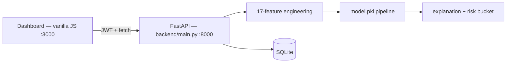

# FraudGuard AI — Financial Fraud Detection

Production-oriented **full-stack ML prototype** for transaction fraud triage:
a FastAPI backend with a calibrated sklearn fraud model, JWT auth, review
workflow, and a vanilla-JS dashboard. ("Prototype" is deliberate — the dataset
is synthetic and the limitations below are part of the design record.)

## Problem

Score payment transactions for fraud risk in real time, explain *why* a
transaction was flagged, and give bank staff a queue to approve or reject
blocked payments — with every ML claim reproducible from the repo.

## System architecture



Details: [`docs/architecture.md`](docs/architecture.md)

## ML pipeline

- **Data:** synthetic, 15,000 rows, 10.78% fraud (`dataset/transactions.csv`,
  generator: `dataset/generate_data.py`, seed 42).
- **Features (17):** 11 raw (`amount, location, transaction_type, time_of_day,
  distance_from_home, device_trust_score, failed_attempts_24h, txn_velocity_1h,
  merchant_risk_score, is_international, card_present`) + 6 derived
  (`amount_log, night_risk, distance_amount_pressure, trust_gap,
  velocity_pressure, cross_border_card_not_present`). One canonical builder —
  `backend/ml_features.py::build_feature_frame` — is shared by training and
  inference (contract-tested).
- **Candidates** (`backend/train_model.py`, seed 42, stratified 64/16/20):

| Candidate | Val AP | Recall | Precision | F1 | Composite |
|---|---|---|---|---|---|
| **BalancedLogisticRegression** ✅ | 0.9216 | 0.9266 | 0.9836 | 0.9543 | 0.9385 |
| CalibratedExtraTrees | 0.9206 | 0.9266 | 0.9836 | 0.9543 | 0.9381 |
| CalibratedRandomForest | 0.9175 | 0.9266 | 0.9836 | 0.9543 | 0.9367 |

- **Threshold:** 0.78, selected on **validation only** (utility = 0.65·F1 +
  0.20·precision + 0.15·recall, clipped to [0.35, 0.78]).

## Evaluation (held-out test, n=3000, threshold 0.78)

Measured by `python -m backend.evaluate` → [`reports/model_evaluation.json`](reports/model_evaluation.json):

| Metric | Value |
|---|---|
| Accuracy | 0.9873 |
| Precision | 0.9734 |
| Recall | 0.9071 |
| F1 | 0.9391 |
| ROC-AUC | 0.9534 |
| PR-AUC | 0.9183 |
| False positives | 8 (FPR 0.0030) |
| False negatives | 30 (FNR 0.0929) |

Confusion matrix: TN 2669 · FP 8 · FN 30 · TP 293. Full sweep + permutation
importance: [`docs/model-evaluation.md`](docs/model-evaluation.md)

## Explainability

Each prediction returns a structured `explanation`: probability vs operating
threshold, risk bucket, and the triggered factors with observed values
(e.g. `"device trust 22/100 ≤ 35"`), plus a non-causality disclaimer. Global
permutation importance (validation subsample, seed 42) ships in the evaluation
report. Methodology + limits: `backend/explain.py`, [`docs/model-evaluation.md`](docs/model-evaluation.md).

## API (base `http://localhost:8000`, docs at `/docs`)

| Area | Endpoints |
|---|---|
| System | `GET /`, `GET /health` |
| Auth | `POST /api/auth/register`, `POST /api/auth/login`, `GET /api/auth/me` |
| Predict | `POST /api/transactions/predict` (60/min), list/get/delete transactions |
| Analytics | `GET /api/analytics/dashboard`, `/alerts`, `/model-metrics`, `/export/csv` |
| Simulator | `POST /api/simulate/one`, `GET /api/simulate/stream?token=` (SSE) |
| Review | `GET /api/review/queue`, `POST /api/review/{id}/approve\|reject` |
| Model (admin) | `POST /api/model/train` (3/hr), `GET /api/model/status\|info\|history` |
| DB viewer | `GET /api/db/tables`, `GET /api/db/table/{name}` |

## Authentication & security

bcrypt passwords, HS256 JWT (60-min), admin/user roles, slowapi rate limits
(global 200/min + per-route predict/train limits — now actually enforced; they
were config-only before). Secrets and demo credentials are env-controlled
(`.env.example` provided); see [`docs/security.md`](docs/security.md) for the
handling policy and known gaps.

## Dashboard

Vanilla HTML/CSS/JS (`frontend/`): login, KPI cards, hourly/donut/daily charts
(Chart.js), live SSE feed, predict form (12 raw inputs), analytics with model
leaderboard, fraud alerts, review queue, DB browser, admin retrain panel.
Seeded logins for local demo: `admin/admin123`, `demo/demo1234`.

## Quickstart

```bash
python -m venv .venv && source .venv/bin/activate
pip install -r requirements.txt               # pinned, reproducible
cp .env.example .env                          # local demo defaults
python -m uvicorn backend.main:app --reload --port 8000
# API docs: http://localhost:8000/docs   |   health: http://localhost:8000/health

docker-compose up --build                     # api :8000 + nginx UI :3000
```

ML + quality commands (all genuinely runnable):

```bash
pip install -r requirements-dev.txt
pytest                                        # 132 tests, ~5s
pytest --cov=backend --cov=config --cov-report=term-missing   # 85% total
ruff check backend config tests
python -m backend.evaluate                    # reproduce reports/ + docs/model-evaluation.md
python backend/train_model.py                 # full retrain (overwrites artefact — see below)
```

## Testing & CI

132 pytest tests, 85% coverage, GitHub Actions (`.github/workflows/ci.yml`):
ruff → pytest+coverage → offline `evaluate` to `/tmp` (never commits
artefacts) → app import check, on Python 3.11 with pinned requirements.
Details: [`docs/testing.md`](docs/testing.md)

## Reproducibility

Seed 42 end-to-end; splits 9600/2400/3000; threshold from validation only;
machine-readable [`reports/model_evaluation.json`](reports/model_evaluation.json).
**Caveat:** the committed CSV (15k rows, 7 raw columns) predates the current
generator — newer raw features train on defaults. Regenerate + retrain before
citing beyond demo use. Full notes: [`docs/reproducibility.md`](docs/reproducibility.md)

## Limitations

- Synthetic data — metrics describe generator patterns, not real-world fraud.
- SQLite, single process; no auth lockout/revocation; DB viewer is auth-only
  (not admin-only); SSE simulator uses its own DB sessions.
- Legacy `backend/app.py` / `backend/db.py` are a frozen Flask prototype
  (see `backend/LEGACY.md`), excluded from coverage.

## Evidence index

- [`docs/architecture.md`](docs/architecture.md) · [`docs/model-evaluation.md`](docs/model-evaluation.md) · [`docs/testing.md`](docs/testing.md) · [`docs/security.md`](docs/security.md) · [`docs/reproducibility.md`](docs/reproducibility.md)
- [`PROJECT_CONTEXT.md`](PROJECT_CONTEXT.md) (agent/handoff source of truth) · [`AGENTS.md`](AGENTS.md)
