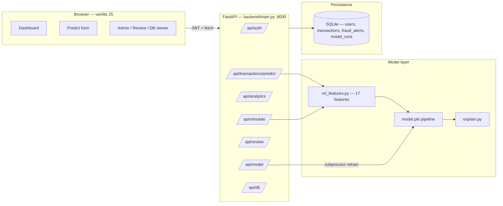

# Architecture

Production-oriented full-stack ML prototype for fraud triage. (The word
"prototype" is deliberate — see [Limitations](#limitations).)

## Request path (prediction)

1. `POST /api/transactions/predict` validates via `TransactionIn` (pydantic v2 —
   ranges + location/type enums), rate-limited (`60/minute`, enforced by the
   shared `backend/rate_limit.py` limiter).
2. `normalize_transaction_payload` clamps/defaults raw input, `build_feature_frame`
   adds 6 derived features → 17-column frame (`backend/ml_features.py`).
3. The `model.pkl` sklearn pipeline (one-hot + RobustScaler + calibrated
   classifier) returns P(fraud); the artefact threshold (0.78) maps to a label;
   app buckets (High ≥0.85 / Medium ≥0.60) map to a risk category.
4. `explain_transaction` attaches triggered factors + disclaimer.
5. Transaction + optional `FraudAlert` persist atomically; response returns
   probability, label, risk, reasons, explanation, status.

## Key files

| Concern | File |
|---|---|
| App wiring, CORS, lifespan seeding | `backend/main.py` |
| Rate limiter singleton | `backend/rate_limit.py` |
| Auth (bcrypt + JWT) | `backend/auth.py` |
| ORM models | `backend/models_db.py` |
| Schemas | `backend/schemas.py` |
| Features (contract) | `backend/ml_features.py` |
| Inference + reasons | `backend/model.py` |
| Explanations | `backend/explain.py` |
| Training | `backend/train_model.py` |
| Offline evaluation | `backend/evaluate.py` |
| Config (env-driven) | `config/settings.py` |

## Frontend

Vanilla HTML/CSS/JS (`frontend/`), no framework. JWT in `localStorage`, Chart.js
for charts, SSE stream for the live feed (`GET /api/simulate/stream?token=` —
query-param auth because `EventSource` cannot set headers). Served by nginx on
`:3000` via docker-compose, or open `index.html` directly. The predict form
sends the 12 raw inputs; the 17-feature expansion happens server-side only.

## Training / retraining

`POST /api/model/train` (admin, `3/hour`) spawns `backend/train_model.py` in a
subprocess, records a `ModelRun` row, and hot-reloads `backend.model`. Full
retraining is manual/operator-triggered — CI only *evaluates* the committed
artefact (`python -m backend.evaluate`), never retrains.

## Limitations

- SQLite + single process; no horizontal scaling story.
- DB-viewer reads the sqlite file directly; the SSE simulator writes via its
  own session (not request-scoped).
- The committed CSV predates the current generator (see `docs/reproducibility.md`).
- No pagination on some list endpoints beyond `limit/offset` on transactions.
